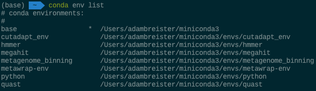
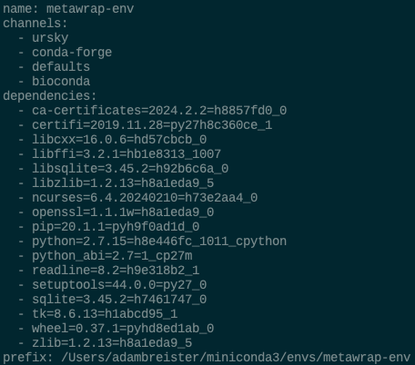

# Anaconda (Miniconda) Practice

## Terminal Options (Optional)

<br>

__PuTTY__

---

PuTTY is a free implementation of SSH and Telnet for Windows and Unix platforms, along with an xterm terminal emulator. It is written and maintained primarily by Simon Tatham.

[from https://www.chiark.greenend.org.uk/~sgtatham/putty/]

<br>

_Installation:_

Download the installer here:<br>
https://www.chiark.greenend.org.uk/~sgtatham/putty/latest.html

For 64-bit system (*which is likely what you have*), download `putty-64bit-0.81-installer.msi`

<br>

__MobaXterm__

---

MobaXterm is your ultimate toolbox for remote computing. In a single Windows application, it provides loads of functions that are tailored for programmers, webmasters, IT administrators and pretty much all users who need to handle their remote jobs in a more simple fashion.

MobaXterm provides all the important remote network tools (SSH, X11, RDP, VNC, FTP, MOSH, ...) and Unix commands (bash, ls, cat, sed, grep, awk, rsync, ...) to Windows desktop, in a single portable exe file which works out of the box. More info on supported network protocols.

[from https://mobaxterm.mobatek.net/]

<br>

_Installation:_

From the following link, install `MobaXterm Home Edition v24.1 (Installer edition)`:

https://mobaxterm.mobatek.net/download-home-edition.html


## Miniconda

<br>

__Description__

---

Miniconda is a free minimal installer for conda. It is a small bootstrap version of Anaconda that includes only conda, Python, the packages they both depend on, and a small number of other useful packages (like pip, zlib, and a few others). If you need more packages, use the conda install command to install from thousands of packages available by default in Anaconda’s public repo, or from other channels, like conda-forge or bioconda. From the Anaconda documentation (https://docs.anaconda.com/miniconda/#quick-command-line-install).

This allows for control over which packages are installed.

<br>

__Installation__

---
<br>

*Mac (macOS)*

```
mkdir -p ~/miniconda3
curl https://repo.anaconda.com/miniconda/Miniconda3-latest-MacOSX-arm64.sh -o ~/miniconda3/miniconda.sh
bash ~/miniconda3/miniconda.sh -b -u -p ~/miniconda3
rm -rf ~/miniconda3/miniconda.sh
```

**This installs miniconda in your home directory (`$HOME [/Users/{username}]`)**

If using bash shell:

`~/miniconda3/bin/conda init bash`

If using zsh shell:

`~/miniconda3/bin/conda init zsh`

<br>

*Windows*

```
curl https://repo.anaconda.com/miniconda/Miniconda3-latest-Windows-x86_64.exe -o miniconda.exe
start /wait "" miniconda.exe /S
del miniconda.exe
```

or

1. Download an executable file for the installer [here](https://repo.anaconda.com/miniconda/Miniconda3-latest-Windows-x86_64.exe).
2. Double-click the `.exe` file.
3. Follow the instructions on the screen. Accept default settings.
4. When the installation finishes, from the Start menu, open Anaconda Prompt.
5. Test your installation by running `conda list`. If conda has been installed correctly, a list of installed packages appears.

<br>

__Commands__

---
<br>

`conda activate`

After installing miniconda, you can use the following command to activate the default conda environment:

```
conda activate
```

To activate any installed conda environments, use the following command:

```
conda activate [environment name]
```
```
conda activate python_env
```
<br>

`conda deactivate`

To deactivate any currently activated conda environments:

```
conda deactivate
```

<br>

[`conda create`](https://docs.conda.io/projects/conda/en/stable/commands/create.html)

To create an entirely new, empty environment:

```
conda create -n [new environment name]
```
```
conda create -n python_env
```

To create new environment with package:

```
conda create -n [new environment name] [package name]
```
```
conda create -n python_env python 
```
<br>

[`conda env`](https://docs.conda.io/projects/conda/en/stable/commands/env/index.html)

To list all environments installed on the current system:

```
conda env list
```



To create an environment definition file from the current conda environment:

```
conda env export --file [file_name.yml]
```



To create an environment based on an environment definition file:

```
conda env create -f [/path/to/environment.yml]
```

To remove a specific conda environment:

```
conda env remove --name [environment name]
conda env remove -n [environment name]
```
&nbsp;&nbsp;&nbsp;&nbsp;&nbsp;&nbsp;_You must have deactivated the environment prior to removal._


<br>

[`conda install`](https://docs.conda.io/projects/conda/en/stable/commands/install.html)

To install a package in a currently active environment:

```
conda install [package name]
```
```
conda install python
```

To install a package into a specified environment:

```
conda install -n [environment name] [package 1] [package 2] [package #]
```

```
conda install -n new_env python numpy pandas
```
<br>

[`conda remove`](https://docs.conda.io/projects/conda/en/stable/commands/remove.html)

To remove a singular package installed in the current conda environment:

```
conda remove [package]
```

To remove a singular package installed in a specified conda environment:

```
conda remove -n [environment name] [package]
```

To remove a list of packages installed in a conda environment:

```
conda remove -n [environment name] [package 1] [package 2] [package #]
```

To remove all packages from a conda environment:

```
conda remove -n [environment name] --all
```

To remove all packages from a conda environment and retain the environment:

```
conda remove -n [environment name] --all --keep-env
```
<br>

[`conda clean`](https://docs.conda.io/projects/conda/en/stable/commands/clean.html)

To remove unused packages:

```
conda clean --packages
conda clean -p
```

To remove unused package tarballs:

```
conda clean --tarballs
conda clean -t
```

To remove leftover temporary files:

```
conda clean --tempfiles
conda clean -c
```
<br>

[`conda update`](https://docs.conda.io/projects/conda/en/stable/commands/update.html)

Accepts a list of packages and will attempt to update them to the latest versions that are still compatible with all other packages in the environment.

To update a singlular package in a conda environment:

```
conda update -n [environment name] [package]
```

To update multiple packages in a conda environment:

```
conda update -n [environment name] [package 1] [package 2] [package #]
```


