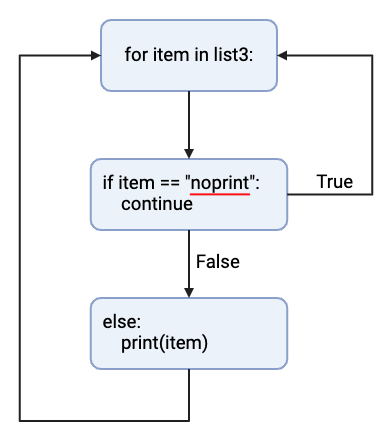

# Python Coding Information

## Table of Contents

1. [Variable Types](#variable-types)
2. [Conditional Statements](#conditional-statements)
3. [Loops](#loops)
4. [Functions](#functions)
5. [User Input](#user-input)

<br>
<br>

## Variable Types

<br>

__String (str)__

---

<br>

*Assignment*


``` python
str1 = "a"
str2 = "abcdef"
str3 = "1"
```

<br>

[*Built-in string functions*](https://www.w3schools.com/python/python_ref_string.asp)

`.split(separator, maxsplit)`

Creates a list of items by splitting a string at a specified character.

``` python
string1 = "1.2.3.4.5.6"

string2 = string1.split(".")
```

Output:

``` python
print(string2)

["1", "2", "3", "4", "5", "6"]
```

Aside from the original version `.split()`, there is another option:

``` 
.rsplit(separator, maxsplit)
``` 

&nbsp;&nbsp;&nbsp;&nbsp;This function returns values starting from the right side of the string

&nbsp;&nbsp;&nbsp;&nbsp;Unless a maximum number of splits is designated, the result will be the same as `.split()`


`.strip()`

``` python
string3 = "123 " # notice the space after 3

string4 = string3.strip()
```

Output:

``` python
print(string4)

123 # the function removed the trailing space

## This is useful for when other functions result in trailing or leading spaces
```

`.join()`

``` python
list1 = ["I", "like", "to", "code", "in", "python"]

string5 = " ".join(list1)
```

Output:

``` python
print(string5)

"I like to code in python"
```

`.endswith()`

This function returns a boolean variable `True` or `False`.

``` python
string6 = "What is the best way to code?"

output1 = string6.endswith("?")
```

Output:

``` python
print(output1)

True
```

`.startswith()`

This function returns a boolean variable `True` or `False`.

``` python
string7 = "/this is a weird way to start a string"

output2 = string7.startswith("/")
```

Output:

``` python
print(output2)

True
```

<br>

__Integer (int)__

---

<br>

*Assignment*


```
int1 = 1
int2 = 1213456789
```

<br>

__Float__

---

<br>

*Assignment*


```
float1 = 1.0
float2 = 1.13942
```

<br>

__List__

---

<br>

*Assignment*


```
list1 = [1, 2, 3, 4]
list2 = ["a", "b", "c", "d"]
```

<br>

__Dictionary__

---

<br>

*Assignment*


```
Dict1 = {"A": 1}
Dict2 = {"L": [1, 2]}
```

<br>

__Tuple__

---

<br>

*Assignment*

```
tup1 = ("x", "y")
```

__Set__

---

<br>

*Assignment*

```
set1 = {1, 2, 3, 4}
```

__Boolean__

---

*Assignment*

``` python
bool1 = True
bool2 = False
```

<br>

## Conditional Statements

<br>

__If ... Else__

---

<br>

*Equals*

``` python
x == y
```

*Not Equals*

``` python
x != y
```

*Less Than*

``` python
x < y
```

*Greater Than*

``` python
x > y
```

*Less Than or Equal To*

``` python
x <= y
```

*Greater Than or Equal To*

``` python
x >= y
```

<br>

There are numerous ways to use these conditional statements. Some examples are shown below.

&nbsp;&nbsp;&nbsp;&nbsp;Using conditionals with integers/floats:

``` python
x = 100
y = 1200

print(x > y)
```

``` python
False
```

``` python
x = 100
y = 1200

if x <= y:
    print("Variable x is less than variable y")
```

``` python
"Variable x is less than variable y"
```

&nbsp;&nbsp;&nbsp;&nbsp;Using conditionals with integers/floats:

*Note: The only usable conditional statments with strings are `=` and `!=`.*

``` python
string8 = abc
string9 = efg

print(string8 == string9)
```

``` python
False
```

``` python
string10 = abc
string11 = abcd

print(string10 == string11)
```

``` python
False
```

``` python
string12 = abc
string13 = abc

if string12 == string13:
    print("These strings are identical")
```

``` python
"These strings are identical"
```

&nbsp;&nbsp;&nbsp;&nbsp;Using conditionals with lists:

``` python
string14 = "a"
list1 = ["a", "b", "c", "d"]

print(string14 in list1)
```

``` python
True
```

``` python
string15 = "a"
list1 = ["a", "b", "c", "d"]

if string15 in list1:
    print("The string has been found in the list")
```

``` python
True
```

## Loops

<br>

__For Loops__

---

<br>

``` python
list2 = ["item1", "item2", "item3", "item4"]

for item in list2:
    print(item)
```

*Note: the term `item` can be set to anything (avoid using default python terms like `if`).*

``` python
"item1"
"item2"
"item3"
"item4"
```

``` python
string16 = "winner"

for letter in string16:
    print(letter)
```

``` python
"w"
"i"
"n"
"n"
"e"
"r"
```

__While Loops__

---

<br>

``` python
int3 = 1

while int3 <= 10:
    print(str(int3)) # Always convert integer into a string before printing
    int3 = int3 + 1 #int3 += 1 | This line increments the variable by 1 each loop
```

``` python
1
2
3
4
5
6
7
8
9
10
```

__`break` Statement__

---

This statement forcibly breaks the loop.

``` python
int4 = 1

while int4 <= 10:
    print(str(int4))
    if int4 == 5:
        break
    int4 += 1
```

``` python
1
2
3
4
5
```

__`continue` Statement__

---

This statement skips the rest of lines of the loop to continue from the next item in the `for` loop.

``` python
list3 = ["item1", "item2", "noprint", "item4", "item5"]

for item in list3:
    if item == "noprint":
        continue
    else:
        print(item)
```



``` python
"item1"
"item2"
"item4"
"item5"
```

## Functions

*Inputting two numeric values*

``` python
def getAverageTwo(value1, value2):
    total = value1 + value2
    average = total / 2
    print(average)


int5 = 26
int6 = 54

getAverageTwo(int5, int6)
```

``` python
40.0
```

*Inputting a list of numeric values*

``` python
def getAverageList(data):
    total = 0
    for value in data:
        total += value
    print(str(total / len(data)))


number_list = [12, 28, 34, 72, 16, 84]

getAverageList(number_list)
```

``` python
41.0
```

*For user readability, variable types can be defined in the definition line*

``` python
def getAverageTwoDef(value1: int, value2: int) -> float:
    total = value1 + value2
    average = total / 2
    return average


int7 = 26
int8 = 54

int9 = 1.06
int10 = 12.18

average1 = getAverageTwoDef(int7, int8)
print(average1)
```
``` python
40.0
```

``` python
average2 = getAverageTwoDef(int9, int10)
print(average2)
```
``` python
6.62
```

&nbsp;&nbsp;&nbsp;&nbsp;*Note: assigning variable types does not force the user to input those types*

<br>

*Variables and Their Interactions with Python Function Definitions*

When defining a python function, you would normally assign variables for use in the function during definition. For example:

``` python
def getAverageTwo(value1, value2):
```

However, this does not mean that the names of variables that will be input into the function need to be the same as those in the definition line.

Assuming the function above is being used, the user could call the function in many ways. For example, both of the following calls will work the same:

``` python
getAverageTwo(number1, number2)
```
``` python
getAverageTwo(twelve, thirteen)
```

You can see that in the calls to the function above, neither call uses the same names for variables as those that are assigned in the function definition line.

<br>

__However__, it should be noted that the names of the variable that are used within the function __MUST__ be those that were defined in the function definition line.

``` python
def getAverageTwo(value1, value2):
    total = value1 + value2
    average = total / 2
    print(average)
```

This means that when you call the function, you may use other names for variables, but those values will be assigned to the variable names in the function definition line once the program enters the function.

One good way to think about this is that when entering the function using two variables called `number1` and `number2`, the following occurs:

``` python
value1 = number1
value2 = number2
```

&nbsp;&nbsp;&nbsp;&nbsp;**Variables within a python function are not global variables**

<br>

One of the main benefits of using python functions is that they can be called multiple times in a script without having to re-write the same code again.

However, if the variables within a function are not available to the rest of the script, how do you transfer the values generated within the function to the rest of the script?


`return`

``` python
def getAverageTwoDef(value1: int, value2: int) -> float:
    total = value1 + value2
    average = total / 2
    return average
```

`return` will allow for variables to be taken from the function to the rest of the script.

As was mentioned before, variables within python functions are not global and cannot be used outside of the function.

Therefore, when returning the variable from the function, any variable name can be used. To return a variable from a function, you can assign a variable with the function call.

``` python
output = getAverageTwoDef(int11, int12)
```

<br>

## Python Packages

*Importing Python Packages*

`import`

Python packages are pre-built groups of python files. Normally this means a group of python modules that give the user more functions to use with the script.

``` python
import sys
import os
```

When inputting packages, the user can define the function names as anything they would like.

``` python
import pandas as pd
import numpy as np
```
&nbsp;&nbsp;&nbsp;&nbsp;*These are two commonly used names*

<br>

## User Input

`input()`

A built-in python function that pauses the program to wait for user input.

``` python
print("Enter an integer")
input1 = input()
print(type(input1))
```

``` python
"Enter an integer"
21
<class 'str'>
```

`sys.agrv[]`

A package that can be imported which specifically deals with python user input.

``` python 
import sys

input2 = sys.argv[1]
print(input2)
print(type(input2))
```

``` python
21
<class 'str'>
```


