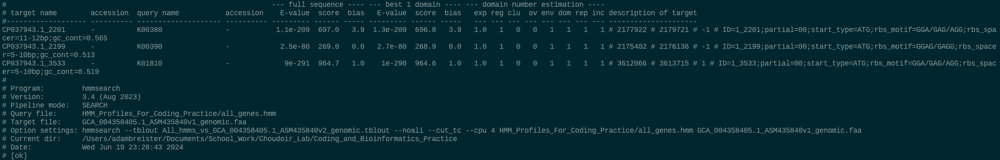
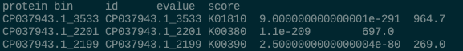

# Python Bioinformatics Tutorial

## Python Bioinformatics

KEGG (Kyoto Encyclopedia of Genes and Genomes) is a large database of metabolic pathways that is commonly used in microbial bioinformatics work.

Today, we will utilize python to assist in identifying genes within a reference bacterial genome.

The genome we will be using is from *Escherichia coli* strain CFSAN027343, which can be found on NCBI [here](https://www.ncbi.nlm.nih.gov/datasets/genome/GCF_004358405.1/).

In order to use `hmmsearch` to find protein sequences, we must first translate the sequences from the genome we obtained.

To do this, we will use a program called `Prodigal`. This program identifies Open Reading Frames (ORFs) and outputs a fasta file with amino acid sequences (`.faa` is a common file extension for these files).

```
conda activate prodigal

prodigal -i GCA_004358405.1_ASM435840v1_genomic.fna -a GCA_004358405.1_ASM435840v1_genomic.faa
```

Then, we can search for HMM profiles within the generated amino acid fasta file using `hmmsearch`.

```
conda activate hmmer

hmmsearch --cut_tc --tblout All_hmms_vs_GCA_004358405.1_ASM435840v2_genomic.tblout --cpu 4 HMM_Profiles_For_Coding_Practice/all_genes.hmm GCA_004358405.1_ASM435840v1_genomic.faa
```



The output table generated by `hmmsearch` is relatively difficult to work with especially if you want to view the output in a program like Excel.

To deal with this, we will use a custom python script that will parse the `hmmsearch` output and generate a `.tsv` file that is more usable for a variety of tasks.

```
conda activate python

python hmmtbl_parser_ab.py All_hmms_vs_GCA_004358405.1_ASM435840v2_genomic.tblout score
```



For now we can use this information to begin digging deeper into our using a python script.

``` python
import sys
import pandas as pd
from Bio import SeqIO
```


## Coding Practice

Now that we have the hmmsearch output, we can use that information to dig deeper into our genome.

<br>

*I recommend using `sys.argv` to input the files*

<details>
    <summary>File Input</summary>

    fasta_file = sys.argv[1]
    hmmsearch_output = sys.argv[2]

</details>

&nbsp;&nbsp;&nbsp;&nbsp;*Note: `sys.argv` ONLY assigns the file path to the variable specified*

---

<br>

Biopython has several functions that make working with fasta files easier. One way to input a fasta file is the `SeqIO.index` function.

``` python
SeqIO.index([filename], [filetype])
```

The filetype that we need to use for this purpose is `fasta`

There are multiple methods to read tables into python. For our purpose, we will use a package called `Pandas`.

``` python
pd.read_csv([filename], delimiter=[delimiter])
```

<details>
    <summary>Reading Files into Program</summary>

    sequence_dictionary = SeqIO.index(fasta_file, "fasta")
    hmmsearch_table = pd.read_csv(hmmsearch_output, delimiter="\t")
    
</details>

---

<br>

When working with `Pandas` tables, you can pull out data by specifying the column name for the table you are working with. 

To do this, you can use the following code:

``` python
pandas_table['column name']
```

Another important function is the `tolist()` function, which will take something like a pandas column and make a list of the data.

``` python
{data to extract}.tolist()
```

<details>
    <summary>Extracting Protein IDs from Record Dictionary</summary>

    protein_sequence_list = hmmsearch_table['protein'].tolist()

</details>

---

<br>

To recursively add items to an empty list, the `append()` function can be used in the following way:

``` python
example_list.append(item)
```

<details>
    <summary>Making List of Sequence Records that Match HMMs</summary>

    sequence_record_list = []

    for protein in protein_sequence_list:
        sequence_record_list.append(sequence_dictionary[protein])
    
</details>

---

<br>

Biopython has a convinient function to write properly-formatted FASTA files.

```
SeqIO.write([listed sequence records], [output filename], [filetype])
```

<details>
    <summary>Writing FASTA File with Only Identified HMM Hits</summary>

    output_file = fasta_file.rsplit("/", 1)[0] + fasta_file.split("/")[-1].rsplit(".", 1) + "_hmm_profiles_seqs.faa"

    SeqIO.write(sequence_record_list, output_file, "fasta")
    
</details>


